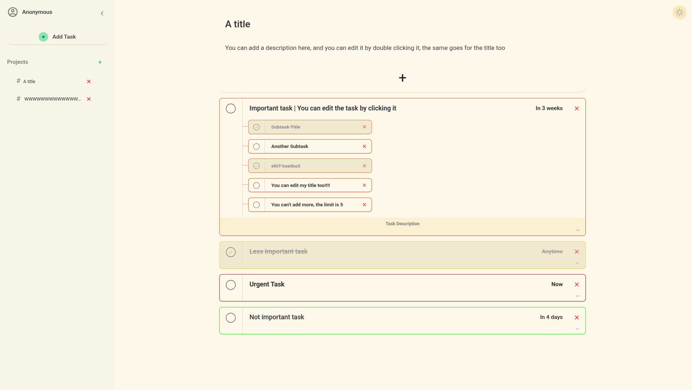

# Todos
**To-do list app made using vanilla JS, HTML, and CSS**

## Page preview

## Features
- Adding Project, each project has :
    - Title (required)
    - Description (optional)
    - Tasks (optional)
---
- Adding tasks, each task has :
    - Title (required)
    - Description (optional)
    - Due date (optional)
    - Priority (required)
    - A Project to be added to (required)
    - Subtasks (optional)
---
- Adding subtask, each subtask has :
    - Title (required)

---
- Deleting any item (project / tasks / subtasks)

- Editing all the details of any item ( project / tasks / subtasks) 

- Marking tasks or subtasks as completed

- Expanding a task to see its subtasks and description

- Switching themes

- Local storage to save your data even after closing the browser 

## A basic how to use 
- **Adding projects** : You can add a project by clicking the "+" button on the sidebar next to "Projects"

- **Adding tasks** : You have 2 ways for adding tasks :
    1. By clicking the "Add Task" button at the top of the sidebar (if you use this way you will need to specify which project the task will be added to)

    2. By clicking the "+" at the top of the project page (the task will be added to the current project by default but you can change this anytime)

- **Adding subtask** : You can add a subtask to a task by:
    1. Clicking the task expand button (at the bottom right)
    2. Clicking the "+" button

- **Editing projects** : You can edit a project by double clicking on the thing that you want to edit (description or title)

- **Editing tasks** : You can edit a task by clicking on it

- **Editing subtasks** : You can edit a subtask's title by clicking on it

- **Removing items** : You can remove an item by clicking the "X" button often next to the item's title

## How to run
[Live preview](https://abdulwhab-elghareeb.github.io/todo-list/)

## Credits
- Roboto font by [Google Fonts](https://fonts.google.com/specimen/Roboto?query=roboto)
- Sun symbol by [Google fonts](https://fonts.google.com/icons?selected=Material+Symbols+Outlined:sunny:FILL@0;wght@400;GRAD@0;opsz@24&icon.size=24&icon.color=%23e3e3e3&icon.platform=web)

- Moon symbol by [Google fonts](https://fonts.google.com/icons?selected=Material+Symbols+Outlined:mode_night:FILL@0;wght@400;GRAD@0;opsz@24&icon.size=24&icon.color=%23e3e3e3&icon.platform=web&icon.query=moon)

- All other images by [Pictogrammers](https://pictogrammers.com/)